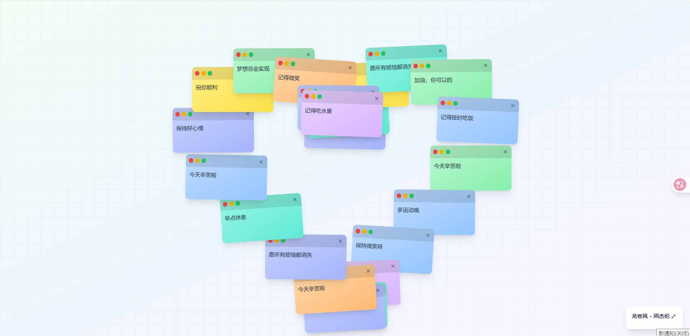

# 抖音爆火！爱心便签墙动画效果网页版完整实现

> 作者：Smartloe  
> 原文链接：[您的CSDN博客链接]  
> GitHub项目：https://github.com/Smartloe/FeelingStickers

## 🎉 项目介绍

最近在抖音上爆火的**爱心便签墙**效果，现在有了网页版！无需下载APP，直接在浏览器中就能体验这份治愈的视觉盛宴。

**FeelingStickers** 是一个基于 React + Vite 开发的动态便签墙应用，便签会自动排列成爱心形状，并循环展示精美的动画效果。完全开源，支持自定义！

## 🐶 效果展示


*便签自动排列成完美的爱心形状*


*便签散开后重新浮现，循环往复*

## ✨ 核心特色

### 🎬 自动循环动画
- **爱心排列**：便签自动移动到爱心位置（1秒）
- **保持展示**：爱心形状保持3秒钟
- **散开消失**：便签散开到屏幕边缘并淡出（1秒）
- **重新浮现**：便签重新出现到随机位置（1秒）
- **无缝循环**：整个过程自动重复，永不停歇

### 🎨 视觉体验
- **柔和过渡**：所有动画使用平滑缓动函数
- **网格背景**：优雅的浅色网格设计
- **多彩便签**：随机颜色的便签卡片
- **响应式设计**：完美适配手机和电脑

### 🎵 背景音乐
- 内置背景音乐播放
- 支持音量控制和播放暂停
- 点击页面任意位置开始播放

## 🚀 快速体验

### 在线体验
项目已部署到 GitHub Pages，点击即可体验：
**[https://smartloe.github.io/FeelingStickers/](https://smartloe.github.io/FeelingStickers/)**

### 本地运行
想要自己动手体验？只需简单几步：

1. **克隆项目**
```bash
git clone https://github.com/Smartloe/FeelingStickers.git
cd FeelingStickers
```

2. **安装依赖**
```bash
npm install
```

3. **启动开发服务器**
```bash
npm run dev
```

4. **打开浏览器**
访问 `http://localhost:8081` 即可看到效果！

## 🛠️ 技术实现

### 技术栈
- **前端框架**：React 18
- **构建工具**：Vite
- **样式方案**：Tailwind CSS
- **图标库**：Lucide React
- **状态管理**：React Hooks

### 核心算法

**爱心形状计算**
```javascript
// 爱心形状参数方程
for (let t = 0; t <= 2 * Math.PI; t += 0.1) {
  const x = 16 * Math.pow(Math.sin(t), 3);
  const y = 13 * Math.cos(t) - 5 * Math.cos(2*t) - 2 * Math.cos(3*t) - Math.cos(4*t);
  heartPoints.push({ x, y });
}
```

**动画循环控制**
```javascript
// 四个阶段的动画序列
arranging → holding → dispersing → reappearing
```

## 💡 项目价值

### 学习价值
- **前端动画实战**：学习复杂的动画序列控制
- **React状态管理**：掌握复杂状态流转
- **数学算法应用**：了解参数方程在前端的应用
- **性能优化**：学习动画性能优化技巧

### 实用价值
- **个人网站装饰**：可作为个人网站的动态背景
- **表白神器**：浪漫的爱心效果，适合特殊场合
- **减压工具**：治愈的动画效果，缓解压力

### 二次开发
- 修改便签数量和颜色
- 调整动画时长和效果
- 更换背景音乐
- 添加交互功能

## 📱 使用技巧

### 自定义设置
在 `src/pages/Index.jsx` 中可以轻松自定义：

**修改便签数量**
```javascript
// 修改初始便签数量
for (let i = 0; i < 20; i++) {  // 改为20个
  // ...
}
```

**调整动画时长**
```javascript
// 排列动画时间：1000ms → 2000ms
// 保持时间：3000ms → 5000ms
```

### 部署到自己的服务器
项目支持多种部署方式：
- GitHub Pages
- Vercel
- Netlify
- 自有服务器

## 🤝 参与贡献

欢迎各位开发者参与项目改进！

1. Fork 本项目
2. 创建特性分支
3. 提交您的修改
4. 推送到分支
5. 创建 Pull Request

**目前需要的改进：**
- [ ] 移动端优化
- [ ] 更多动画效果
- [ ] 主题切换功能
- [ ] 便签内容编辑

## 📞 联系我们

- **GitHub**: https://github.com/Smartloe/FeelingStickers
- **Issues**: 遇到问题请提交 Issue
- **Email**: [您的邮箱]

## 🎯 总结

**FeelingStickers** 不仅复刻了抖音热门的爱心便签墙效果，更在技术上进行了深度优化。项目完全开源，代码清晰易懂，是学习前端动画和 React 开发的绝佳案例。

无论你是想体验治愈的动画效果，还是学习前端开发技术，这个项目都值得一试！

**立即体验** 👉 [项目链接]

---

*如果觉得项目不错，请给个 ⭐ Star 支持一下！*
